# Project 2 - Implementing Neural Network in CUDA

In this repository is code that "discovers" the Morse potential via a feedforward neural network and backpropagation.
You'll now work towards getting the code running efficiently on GPUs.
As you'll note, this `README.md` doesn't include much specific information on exactly what you should do.
Use the skills and knowledge you've gained over the course of this semester to make intelligent decisions wherever the instructions leave room for interpretation.

## Task 1 - Port the Code to GPUs

The code currently runs on the CPU.
Rewrite it to run on GPUs, making an effort to optimize for efficiency.

## Task 2 - Profile the Code

Perform profiling tests on Perlmutter, including analysis of Roofline plots.
Analyze the time cost of training your model with respect to the number of hidden layers, the size of the hidden layers, and the size of the training dataset.
Include your data and plots here, and explain your conclusions regarding the profiling results.

## Task 3 - Increase the Size of the Calculation

Note that the Morse potential problem is too small to effectively utilize Perlmutter's resources.
Modify your code to solve a more physically complex problem that can better utilize the Perlmutter GPUs.
For example, what if instead of trying to learn a Morse potential for a two-body system, you tried to learn a potential energy surface for a three-body or four-body system?
You may select a physical problem unrelated to molecular dynamics, if you prefer.
Provide this code **in addition** to the code for Tasks 1 and 2; in other words, submit code that solves the new problem as well as code that discovers the Morse potential.

Repeat your Perlmutter profiling calculations with the new system and discuss your results.

## Task 4 - Discuss the Code

Discuss your code's parallelization strategy.
Why did you choose this strategy?
In what ways could the code's performance be improved?
Describe some ways in which your neural network implementation would need to change to accommodate machine learning in the context of a condensed-phase molecular dynamics simulation involving thousands of atoms.

Your response to this task should be fairly extensive (>1,000 words).

## Answers

### Overview
The purpose of this project was to port over a basic neural network implementation that runs on a CPU, to a code that runs on a GPU. The general strategy was to limit data transfers from the CPU to GPU as much as possible and perform all arithmetic logic via custom CUDA kernels using pycuda. Initially a simple 1-dimensional energy problem for the Morse potential was used as a basic example. This problem was trivial to compute even on a CPU. A more complex, four-body problem to calculate the potential energy surface of an AB3 molecule like ammonia was used as a more computationally difficult training problem. Each of these problems were profiled on Perlmutter with varying network depth, width and batch sizes. Additionally the accuracy of solving the AB3 problem based on depth and width was assessed.

For training there are two different training problems. The morse potential problem and a four-body problem to calculate the PES of ammonia. Examples of how to execute this code can be seen below:

```
# To train on gpu, load a setup json file with network parameters. Json allows user to specify problem, either Morse or AB3 along with architecture and hyperparameters.

python3 src/neuralnet.py setup/model_setup.json --train --gpu

# To evaluate, load the setup json and weights from trained model

python3 src/neuralnet.py setup/model_setup.json --eval --weights models/saved_weights.npz
```

### Parallelization Strategy
This code was designed to be as flexible as possible, allowing the user to run on either the CPU or GPU, train and save model weights, and then load model weights later for evaluation. The general strategy was to port over all of the logic from the `feed_forward()`, `back_propagation()` and `apply_gradient()` methods to CUDA. These CUDA kernels are found in `cuda_kernels.py`. Depending on the device the user wants to run on, the same methods are called but will direct to either numpy based CPU calculations or CUDA based GPU calculations. The first kernel that was developed was the `matrix_multiply` kernel. For this a naive implementation was used which achieves an $O(N^3)$ runtime complexity. Additionally, a shared memory strategy was implemented due to multiple GPU threads needing to access the same data multiple times, i.e., we have $O(N^3)$ operations but only $O(N^2)$ data. The only other kernel where shared memory was required was the `transpose_matrix`, but for a different reason. If we try and transpose directly into global memory we take a contiguous row and move it into a column with a massive stride between elements. This is very memory inefficient. So by moving the tile into shared memory, the smaller stride after transposing is typically fine. All other kernels like `apply_weights_and_biases` and `add_bias` are just element wise operations and do not have the same issues with long strides. Therefore it is more efficient to just keep that data on the global RAM instead of transferring to the shared memory cache. 

With all of these kernels in place to perform the various arithmetic required for the neural net, python was used to orchestrate the data transfers and order of operations. For each training epoch, data is transferred from the CPU to GPU for every batch before performing the feed forward, back propagation and apply gradient methods. The loss is then returned from the GPU to the CPU. Therefore we just have two data transfers per epoch per batch. The strategy to utilize the A100 GPUs as much as possible was to maximize the batch size. On my local GPU for 131072 inputs, I can run a batch size of 4096 which fully saturates my GPU. This means that I have 64 data transfers from the CPU to GPU per epoch. On the A100, we can fit all inputs into a single batch which significantly reduces the data transfers during training and better utilizes the GPU bandwidth. The impact on how memory bound the process is depending on batch size will be discussed in the profiling section of this report. 

Overall the code runs efficiently on the GPU and as the difficulty of the problem scaled up for the four-body problem compared to the Morse problem, running on the CPU became entirely not feasible. That being said there are several areas of improvement that would make this code more efficient. The first and most obvious problem is that the matrix multiplication is not optimized. There are far more efficient strategies that can achieve sub $O(N^3)$ complexity and all modern matrix multiplication libraries utilize these strategies. When running on Perlmutter with huge batch sizes that better utilize the GPU bandwidth, upgrading to a more optimized algorithm would help us achieve a greater arithmetic intensity. Additionally the training process was orchestrated via Python which inherently adds unnecessary overhead. Common machine learning libraries for Python like PyTorch are written in C++ to achieve better performance and for this code it would have been more optimal to have done the same strategy.

In order to apply this neural net implementation to an even more demanding problem like condensed-phase molecular dynamics, some adjustments would need to be made. Right now for the four body problem we have six inputs, the three bond lengths and three bond angles. Trying to scale this to thousands of atoms and their coordinates is entirely not feasible. A potential strategy in this case would be to apply what was developed in the previous project where we had implemented a parallelized molecular dynamics code using MPI. In that strategy, spatial decomposition was able to limit the problem to a smaller local environment. In the future we could combine these strategies where work is distributed across CPUs for different spatial domains and then those CPUs communicate with GPUs to perform the neural net calculations for each domain. This kind of hybrid approach is exactly what is required to use neural networks to make predictions about energy of huge molecular systems.

### Profiling Discussion

Both the Morse and four-body AB3 molecule problems were profiled to generate roofline models. Figures 1-4 show several example roofline models for the matrix multiplication kernel and the full summary for the AB3 problem can be found in Table 1. There are several interesting trends that we observe when comparing the two problems as well as the different test conditions. For each problem that the networks were trained on we profiled several different conditions. A base model condition was established with a moderate width, depth and batch size. From there we adjusted each of those parameters to see their impact on performance. First we can compare the base models from the Morse (Fig 1) and AB3 (Fig 2) problems. We see that they have a similar arithmetic intensity that suggests a compute bound process, with 7% of FP32 peak performance for Morse and 16% FP32 peak performance for AB3. In reality both of these processes are still memory bound. The roofline plot is showing the threshold for DRAM throughput which is very low for both problems, thus suggesting a compute bound process. However the L1 cache throughput is very high for both, exceeding the compute throughput in both cases. Due to the shared memory strategy we are using for matrix multiplication, there are very few calls to DRAM but we are still moving a lot of memory around in L1 cache relative to our overall compute. We can see that when we throw a more challenging problem at the GPU the performance increases. All of this suggests that overall the GPU is still starved for work and not nearly at its limit even with the more difficult AB3 problem.

Another interesting observation is in regard to architecture and batch size for the AB3 problem. As seen in Table 1, there is effectively no change in AI or performance regardless of the network architecture. The only change arises from adjusting the batch size. We can visually see the difference in Figures 3 and 4 for a 256 and 131072 batch size respectively. In the case of the larger batch, this exactly matches the number of training inputs. Due to the shared memory approach and a constant tile size, the architecture has little impact on the overall computational performance shown in the roofline plot. The rate of how much work is being done is the same, it's just that in the case of a deeper or wider network there is more work to be done. We can see that in the overall training time in table 1 for these different tests. In theory it makes sense that the performance should increase as we increase the batch size. We provide more work for the GPU to process at once so the performance improves. However we would also expect that the AI should increase with our batch size as well, but we actually observe the opposite. The base model has the best AI and the largest batch size has the worst. The reason being is that we provided so much work for the GPU that we are starting to exceed what we can store in cache at any given time causing more misses. Ideally we would find a sweet spot between the massive batch and base size batch which minimize cache misses to maximize performance and AI.

Lastly, I wanted to examine the impact on architecture on model performance, not just training efficiency. Just because it would be faster to train a shallow model does not mean that we will get the desired result. Figures 5-9 show the RMSE for two model evaluations across different architectures. For each test we see a predicted energy relative to stretch length in angstroms and bend angle in degrees for an Ammonia molecule. True energies were derived using RDKit for these different geometries. We see that the deep model has the best RMSE for both the stretch and bend predictions of 3.89 and 0.98 kcal/mol respectively. This is slightly better than the base model at the cost of a longer training time. Interestingly the shallow model performed nearly equivalently to the base model while the narrow model performed horribly. The wide model also performed poorly at the bend evaluation and had the longest training time by far.  

In conclusion, these profiling results highlight several core principles behind high performance GPU programming. The main challenge was not necessarily developing the fastest matrix multiplication algorithm, it was keeping the GPU working and avoiding idle time while data is being moved around. Utilizing huge batch sizes helped improve performance but hurt AI due to increased cache misses. Every decision has a tradeoff and fancy algorithms will do little to solve a problem that is severely memory bound. Additionally with neural networks you can be forced into a computationally expensive solution for your given problem. With the AB3 problem, we had to train for longer with a deeper network to get a good result. Theoretically with even more complex molecular dynamics problems this issue would be further exacerbated and would require additional high performance strategies like spatial decomposition to make computation reasonable to perform.

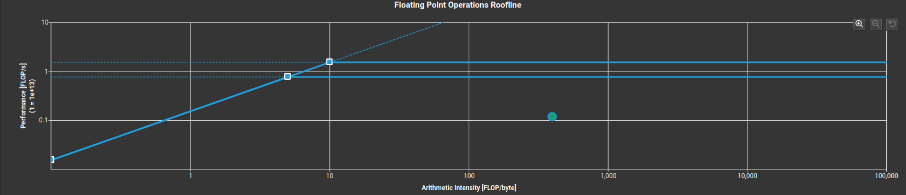
#### Figure 1. Morse Base Model Roofline

#### Figure 2. AB3 Base Model Roofline
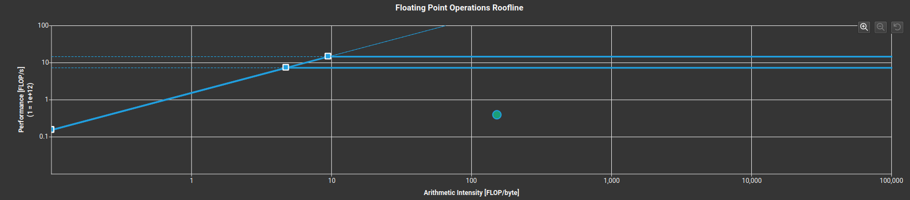
#### Figure 3. AB3 Small Batch Roofline
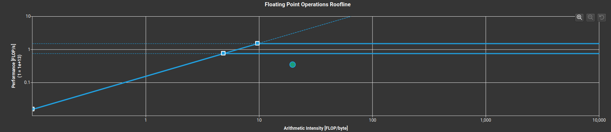
#### Figure 4. AB3 Large Batch Roofline

| Test        | Architecture                       | Inputs | Batch Size | Performance (% FP32 Peak) | Intensity (FLOP/Byte) | 5000 Epoch Runtime (s) |
|-------------|------------------------------------|--------|------------|---------------------------|-----------------------|------------------------|
| Base        | [6, 128, 128, 64, 32, 1]           | 131072 | 4096       | 16                        | 317                   | 411                    |
| Shallow     | [6, 128, 64, 1]                    | 131072 | 4096       | 16                        | 317                   | 247                    |
| Deep        | [6, 128, 128, 128, 128, 64, 32, 1] | 131072 | 4096       | 16                        | 317                   | 582                    |
| Narrow      | [6, 32, 32, 16, 16, 1]             | 131072 | 4096       | 16                        | 317                   | 319                    |
| Wide        | [6, 512, 512, 256, 128, 1]         | 131072 | 4096       | 16                        | 317                   | 715                    |
| Small Batch | [6, 128, 128, 64, 32, 1]           | 131072 | 256        | 3                         | 153                   | -                      |
| Large Batch | [6, 128, 128, 64, 32, 1]           | 131072 | 131072     | 23                        | 20                    | -                      |

#### Table 1. AB3 Matrix Multiplication Roofline Results

| AB3 Stretch Prediction | AB3 Bend Prediction |
| :---: | :---: |
| 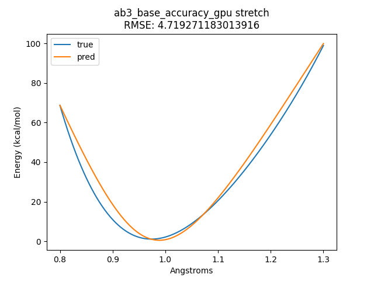 | 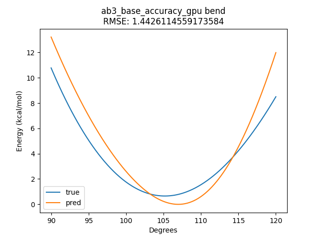 |
| Fig 5A. Base Model Stretch [6, 128, 128, 64, 32, 1] | Fig 5B. Base Model Bend [6, 128, 128, 64, 32, 1] |
| 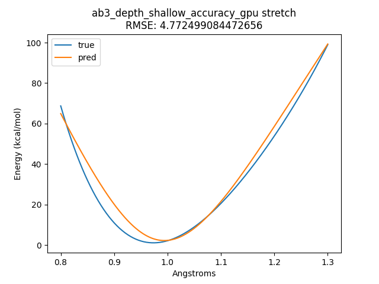 | 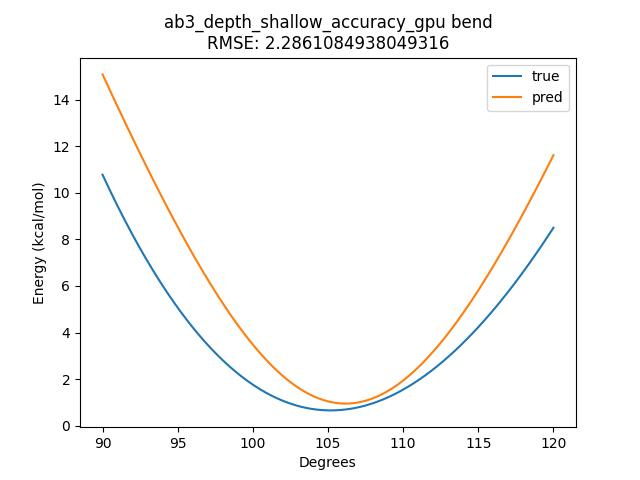 |
| Fig 6A. Shallow Model Stretch [6, 128, 64, 1] | Fig 6B. Shallow Model Bend [6, 128, 64, 1] |
| 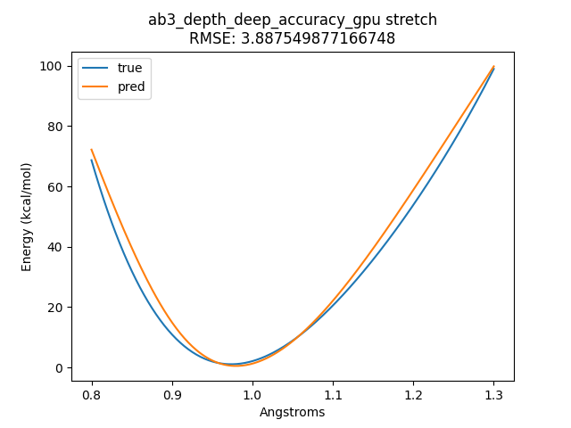 | 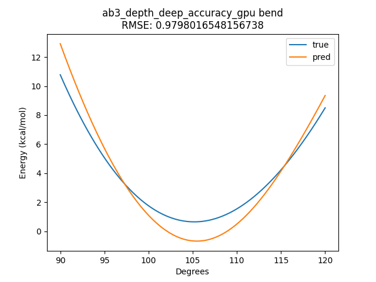 |
| Fig 7A. Deep Model Stretch [6, 128, 128, 128, 128, 64, 32, 1] | Fig 7B. Deep Model Bend [6, 128, 128, 128, 128, 64, 32, 1] |
| 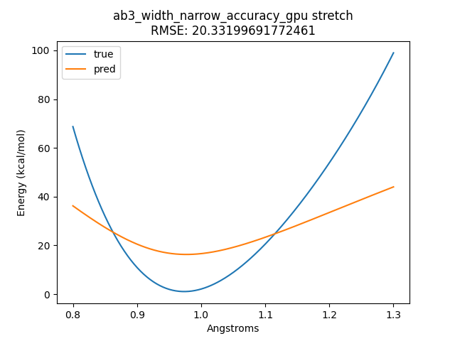 | 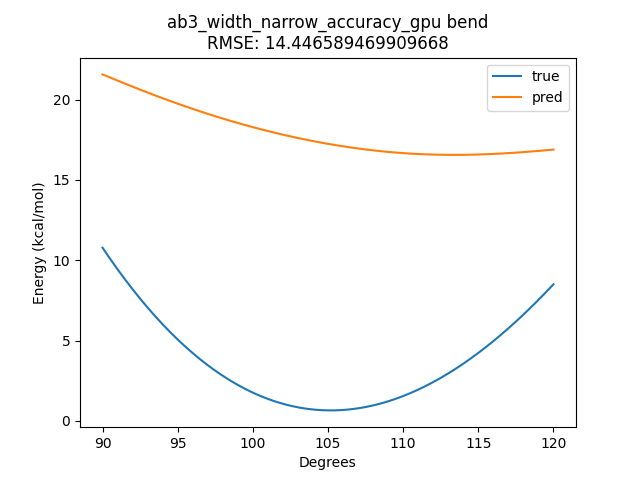 |
| Fig 8A. Narrow Model Stretch [6, 32, 32, 16, 16, 1] | Fig 8B. Narrow Model Bend [6, 32, 32, 16, 16, 1] |
| 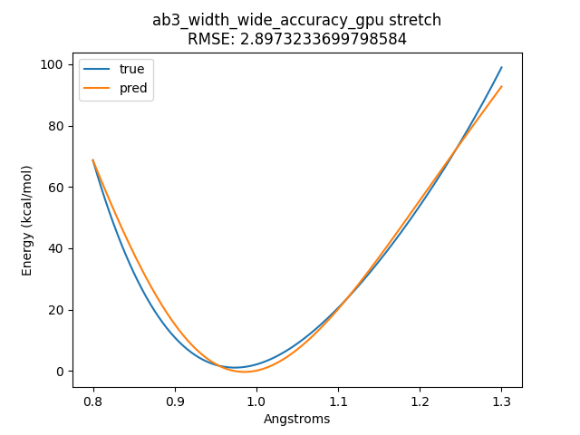 | 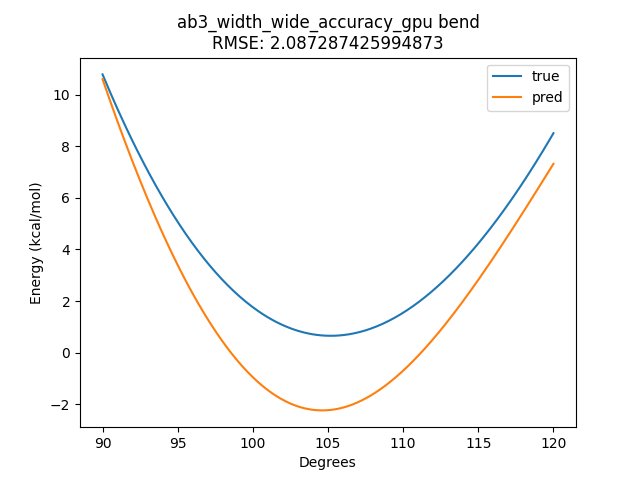 |
| Fig 9A. Wide Model Stretch [6, 512, 512, 256, 128, 1] | Fig 9B. Wide Model Bend [6, 512, 512, 256, 128, 1] |


